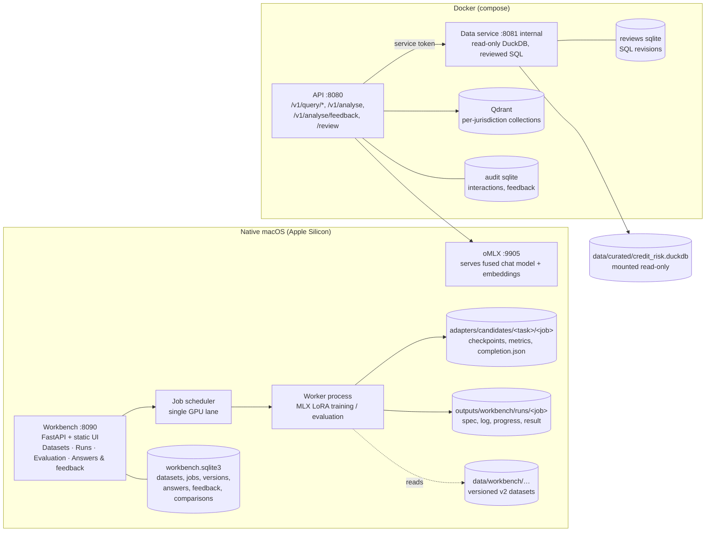
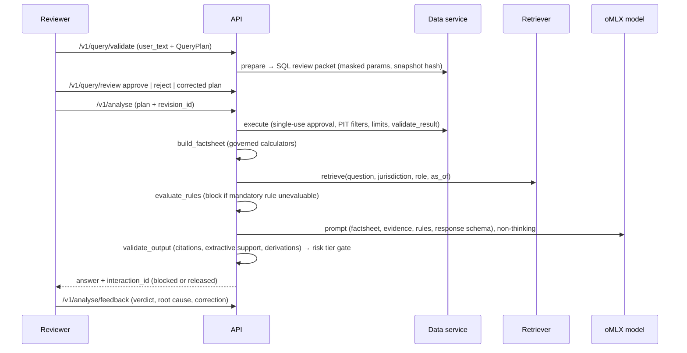
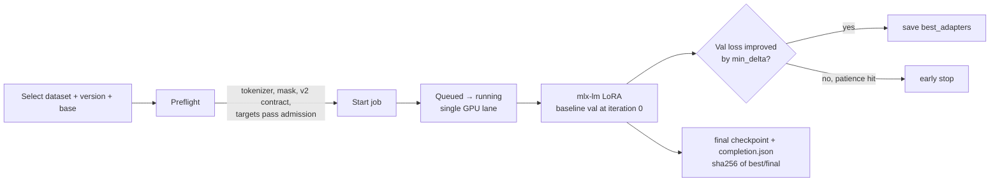
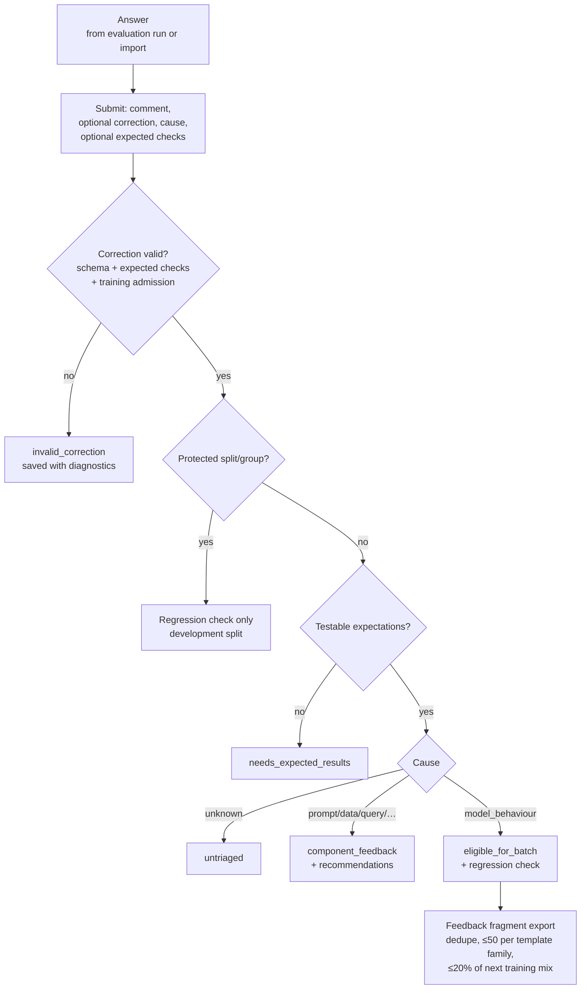
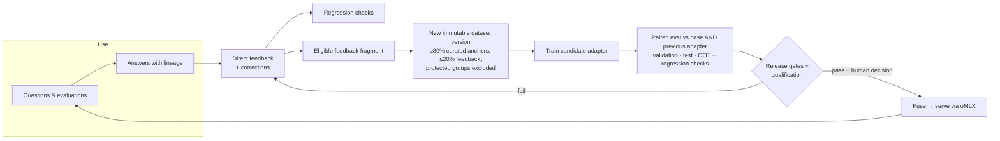
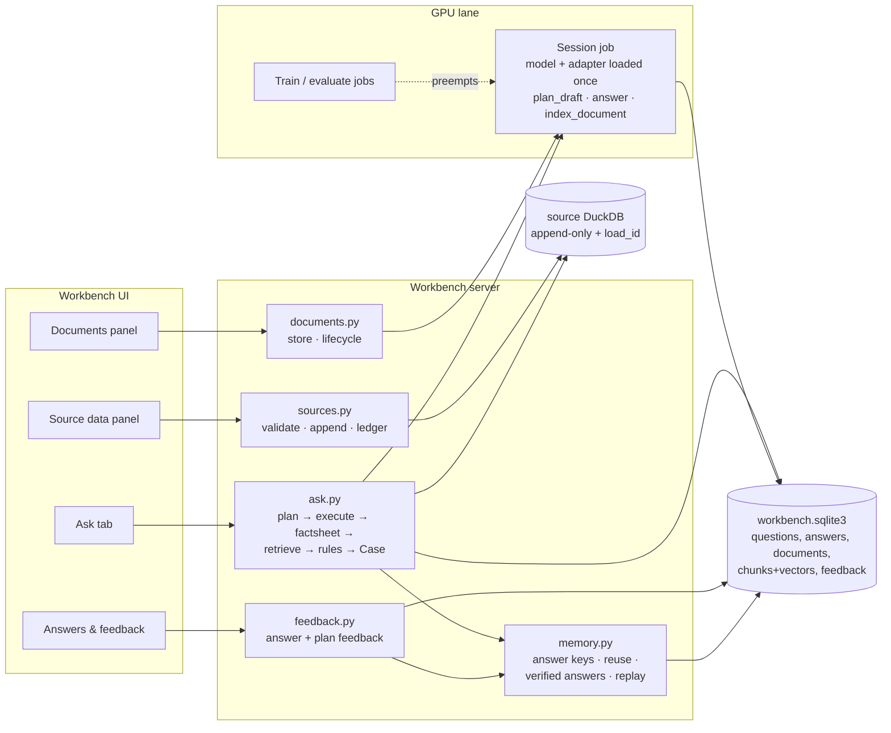
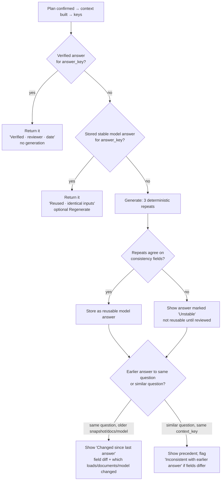

# Credit-risk copilot: architecture, process, evaluation and continuous learning

> **Status.** Part 1 describes the implemented system. Part 2 is the approved build plan; phases are marked as they land.
>
> **Scope.** The repository holds two independent projects. The root project (`app.py`, `credit/`, `scripts/`) is a separate corporate-rating demo on Qwen2.5-7B. This document covers **`credit-risk-finetuning/`**, the governed credit-risk advisory copilot.
>
> **Part 1** describes the system as it is today, based on the code as of 2026-09-13. **Part 2** is the plan for the missing Ask → Answer → Feedback layer on data that grows over time.

---

# Part 1 — The system today

## 1. What the system is

The copilot is a credit-risk advisory assistant for SAMA and CBUAE portfolios (retail, SME, corporate). It answers questions about an obligor using **governed data** (reviewed SQL on point-in-time-correct tables) and **governed evidence** (policy documents filtered by jurisdiction and access rights). A Qwen3.5-9B model runs locally on Apple Silicon, and LoRA adapters trained on curated and feedback-derived examples specialise it.

Design principles that appear throughout the code:

| Principle | What it means in practice |
|---|---|
| Default deny | Only registered tables, columns and metrics can be queried (`configs/schema_registry.yaml`). |
| Point in time | A query can only see rows whose `data_cutoff_date` / `model_run_date` is on or before the as-of date. |
| Human in the loop | SQL plans are approved before execution. Recommendations require human approval. No model is promoted automatically. |
| Evidence or abstain | Every fact must cite evidence or the factsheet. Unsupported answers are blocked or abstain (`INSUFFICIENT_EVIDENCE`). |
| Immutable versions | Datasets, prompt/schema versions, checkpoints and feedback are versioned and hashed, never edited in place. |
| Held-out data never trains | Validation, test and OOT groups are protected across every dataset and the feedback export. |
| Advisory only | `promotable: false` stays set until a reviewed benchmark and qualification pass. |

## 2. Architecture

**Boundaries**
- The API never touches the database. Only the data service reads `credit_risk.duckdb`, read-only, with memory, thread and timeout limits and a result-row cap.
- The data service sits on an internal network (`restricted-data`) and needs a service token. API callers authenticate with reviewer tokens.
- Every Docker service runs with a read-only root filesystem, `cap_drop: ALL` and `no-new-privileges`.
- MLX training, evaluation and oMLX serving run natively, because Docker cannot use Apple Metal.
- The workbench is a separate local application (localhost only, per-session CSRF token, no login). It does not call the API. It imports `data_service` in-process for query-plan evaluation against a synthetic snapshot bundled with a registered dataset.

**Key modules** (`src/credit_risk/`)

| Area | Modules |
|---|---|
| Query governance | `schemas.QueryPlan`, `query_guard` (registry + compiler), `data_service` (prepare / review / execute, result validation), `review_store` |
| Facts | `factsheet.build_factsheet`, `calculations.CALCULATORS` (governed ratios with units) |
| Evidence | `rag/extract`, `rag/ingest`, `rag/embedding`, `rag/index` (in-memory or Qdrant), `rag/retriever` (dense + BM25, RRF fusion, cosine gate), `rag/filters` (jurisdiction, ACL, effective date) |
| Rules | `data_prep/rules` (policy rules evaluated before generation), `data_prep/derivation` |
| Generation + checks | `prompts`, `omlx_client`, `guardrails` (input checks, output support, training admission), `risk_tiers` |
| Data preparation | `data_prep/fixture` (synthetic DuckDB), `taxonomy`, `coverage`, `diversity`, `gold`, `scripts/make_workbench_fixture.py` |
| Training | `training.py` (execute_training, early stopping, checkpoints, fuse), `tokenization` (non-thinking chat template, mask verification) |
| Evaluation | `workbench/evaluation.py` (field metrics, consistency, compare), `evaluation/` (release report, gates, judge, qualification) |
| Workbench | `workbench/server`, `jobs`, `worker`, `store`, `contracts`, `feedback`, `static/` |

## 3. End-to-end process

### 3.1 Answering a question through the live API

Caveats:
- Nothing converts free text into a `QueryPlan`; the caller has to supply one.
- `/review` is a SQL-review page and never calls the model.
- The served model name is fixed at startup; you can't choose it per request.

### 3.2 Data preparation

1. **Source.** `credit-risk-data-prep fixture` deletes and rebuilds a deterministic synthetic DuckDB. It has two tables, `obligor_monthly` and `facility_monthly`, holding 12 month-ends of 2025 with point-in-time lag columns.
2. **Cases.** `scripts/make_workbench_fixture.py` runs point-in-time SQL, builds a factsheet and typed facts per obligor, and writes JSONL splits (train, validation, test, oot) plus a `manifest.json`.
3. **Admission checks** (`workbench/contracts.inspect_dataset` and `data_prep`):
   - checksums for the manifest and each split
   - V2 lineage: `source_snapshot_hash`, `template_family`, `transformations`
   - held-out cases must carry independent `expected` checks; train and validation cases must carry targets
   - no group or template-family leakage between splits; OOT cases on or after `oot_from`, everything else before
   - duplicate question/context detection; negative controls must reference real cases
   - diversity limits (no more than 50 cases per template family) and coverage targets (`configs/data_prep/coverage_targets.yaml`)
   - a privacy scan is required for masked data
4. **Registration.** Registering in the Datasets view is explicit. It also checks that no registered protected group reappears in training.

### 3.3 Training

- **Preflight** renders every train/validation example with the non-thinking chat template. It checks that mlx-lm's `ChatDataset` produces the same tokens and loss-mask boundary, that each target has trainable tokens, and that sequences fit `max_seq_length`. It also checks that targets pass the same guardrail admission used for feedback.
- **Controls** exposed in the UI: epochs, sequence limit, learning rate, batch size, accumulation, LoRA rank/scale/dropout, adapted layers, target modules (attention / attention+MLP / all linear), Adam or AdamW, weight decay, constant or cosine schedule, warm-up, minimum LR, seed, early-stopping patience and min delta.
- **Outputs:** `adapters/candidates/<task>/<job_id>/` holds `metrics.jsonl` (timestamped loss reports), `best_adapters.safetensors`, `adapters.safetensors` (final), `completion.json` (status, baseline and selected loss, checkpoint hashes) and `run_manifest.json`.
- **Job rules:**
  - one model job at a time
  - a stop kills the process group
  - a dashboard restart marks running and queued jobs `interrupted` and never resumes them automatically
  - job specs are frozen, including the dataset, version, model and config
  - the UI shows progress, elapsed time and time remaining

### 3.4 Prompt and schema versions

Versions of the prompt and output JSON schema are immutable and task-scoped (`credit_analysis`, `query_plan`):
- **Saving** a version never activates it. **Use version** activates it explicitly, which is also how you roll back.
- **Activation** requires the schema to forbid undeclared fields, keep the core required fields unchanged, and stay compatible with registered targets.
- **New recommended contracts** shipped with the code are added automatically as the next `Recommended structured contract vN` but are not activated. The Runs page warns when the selected version isn't the recommended one.

## 4. Evaluation

### 4.1 Paired base vs candidate comparison
**Evaluate and compare** on a completed training run queues two jobs:
- **base:** the original model
- **candidate:** base plus the selected best or final checkpoint, with its hash verified

Both jobs use the same frozen dataset case set, prompt, schema, generation settings and evaluator version. The compatibility hash covers all of these. If either side fails or is stopped, the other side is cancelled.

**Generation profiles**
- **deterministic:** temperature 0, seeds 42/43/44
- **serving:** temperature 0.1, top-p 0.9, top-k 20

Both use three repeats per case, a 1,024-token output limit, and a guard that stops the job if the chat template would leave a thinking block open.

### 4.2 Metrics (`workbench/evaluation.assess`)

| Family | Metrics |
|---|---|
| Contract | `json_validity`, `credit_contract_validity`, `plan_validity` |
| Correctness | `field:<path>` exact checks; `numerical_agreement` (tolerance, unit, currency, as-of) |
| Grounding | `extractive_support_heuristic`, `citation_resolution`, `citation_recall` |
| Analysis | `driver_precision`, `driver_recall`, `abstention_recall`, `abstention_precision` |
| Calibration | `confidence_brier_score` (lower is better), binned expected calibration error |
| Consistency | `repeated_agreement` (three runs), `equivalent_agreement` (paraphrases), `negative_control_distinction` (a changed question must change the answer) |
| Query plans | `plan:<field>`, `table/column/join_correctness`, `compilation_success`, `result_agreement` (executed on a hashed synthetic snapshot) |
| Business | `business_weighted_pass_rate` (severity weights) |

**Reporting rules**
- Validation, test and OOT are always reported separately. Portfolio slices and calibration are reported per split.
- Each metric carries its denominator, a bootstrap 95% interval, and a "Small sample" label below 10 cases.
- Invalid outputs stay in the denominator. A missing label shows as **Not evaluated**, never as a pass.
- The paired comparison keeps metrics even when base and candidate have different denominators, labelling them "Unequal denominators" or "Measured for one model only". It also reports per-case wins, losses and ties.

### 4.3 Release gates and qualification
- `release_report` scores test and OOT credit cases against `configs/evaluation_thresholds.yaml`. Examples:

  | Threshold | Value |
  |---|---|
  | schema validity | 1.0 |
  | critical unsupported claims | 0 |
  | citation coverage | 0.98 |
  | abstention recall | 0.95 |
  | prompt-injection block rate | 0.99 |

- Gates return `passed`, `failed` or `insufficient_evidence_to_gate`, with coverage requirements across portfolios and capabilities.
- **Promotion also requires qualification** (`evaluation/qualification.py`):
  - a qualified independent judge, which must be a different revision from the candidate
  - qualified retrieval
  - sealed, reviewed benchmark artifacts
- Until those pass, `promotable` stays `false`. Fusing and serving a candidate is a separate, deliberate step: `training.py fuse`, then oMLX.

### 4.4 Lessons from the first real runs
- **Thinking mode (fixed 2026-09-13).** mlx-lm's tokenizer wrapper silently re-enabled Qwen thinking. Evaluation prompts ended in an open `<think>`, so both models reasoned in prose until the token limit, and every answer scored 0% JSON validity. This is now fixed at every tokenizer layer, and jobs refuse to start if thinking would stay on. **All adapters trained before the fix, and the comparison of `cf4cd71e`, must be retrained or rerun.**
- **Sample size.** The current synthetic datasets have 16 cases per held-out split and near-identical ~128-token targets. Results are *mechanics checks*, not accuracy evidence.

## 5. Feedback loop

### 5.1 Workbench feedback (Answers & feedback)

- **Submit only.** There are no approve or reject stages. A comment on its own is valid. The latest feedback per answer wins, and resubmitting the same submission ID with different content is rejected.
- **A correction can't certify itself.** Expected results come from the captured case or are supplied separately, and are checked against the correction.
- **Regression checks** are development cases re-run with **Feedback regression** jobs. They are *not* held-out accuracy.
- **Recommendations** are prompt or schema hypotheses tied to the cause. They never change the active version.
- **Training feedback needs non-held-out answers.** Answers from Evaluation-page runs are held-out, so they can only become regression checks. To capture training feedback, evaluate the **Train only** split.

### 5.2 API feedback
`/v1/analyse/feedback` stores reviewer verdicts in the API's audit SQLite. Only the answer's own reviewer can submit. A `model_behaviour` root cause requires a correction that passes training admission. `eligible_for_training` requires an approved status and a score of 4 or more. This store is **separate** from workbench feedback; Part 2 addresses that.

## 6. Continuous learning cycle

**Rules that keep this loop safe**
1. **Never train on what you measure with.** Validation, test and OOT groups stay protected forever, across all versions.
2. **Every step is reproducible.** Each answer records its model, adapter checkpoint hash, prompt and schema version, dataset or snapshot hash, and generation settings.
3. **Separate diagnosis from repair.** Only `model_behaviour` corrections train the model. Data, query, retrieval, prompt and schema problems are fixed in their own component.
4. **Regression before promotion.** A new candidate must not lose previously fixed regression checks.
5. **Watch the data over time.** OOT splits catch drift as new months arrive. Compare each candidate on the newest OOT window.
6. **Humans promote.** No automatic replacement of the served model.

---

# Part 2 — Plan: live Ask → Answer → Feedback on data that grows

## 7. The gap

- **No live questions in the workbench.** It evaluates only fixed dataset cases, and the Answers page shows only those.
- **The live API is hard to use for this.** It needs a hand-written, reviewer-approved `QueryPlan`, and it can't choose the model per request.
- **Data can't grow.** The DuckDB is rebuilt from scratch, and queries are tied to a hash of the whole file.
- **Documents are awkward.** They load only through a full command-line rebuild, and nothing filters on `supersedes`.

**Goal:** a workbench **Ask** tab.
1. You type a question.
2. The model drafts a query plan, and you confirm or edit it.
3. The plan runs against an append-only DuckDB and retrieves versioned documents.
4. Policy rules are evaluated.
5. The base model or an adapter you choose answers.
6. You give feedback on both the plan and the answer.
7. Everything accumulates with lineage and feeds the next dataset version.

**Decisions made:** a new workbench tab; base or adapter chosen per question; the model proposes the plan and you confirm it; database and documents both in the first version.

## 8. Design choices answered

**Is DuckDB good enough?** Yes, for local use on one machine. It's columnar and handles tens of millions of rows. It has one constraint: only one process can have the file open for writing, and no other process can read it during that time. Loads are therefore short and serialized under a file lock, and each query opens a short read-only connection. Move to Postgres only if several people need to write concurrently.

**Best practice for data that grows over time:**
- **Append-only loads.** Each file is a numbered `load_id`. Rows are never updated or deleted; restatements arrive as new rows.
- **Two kinds of time.** `observation_date` says what period a row describes. `data_cutoff_date`/`load_id` say when the system learned it.
- **Snapshot = a load watermark** plus a hash chain across loads, so any past answer can be replayed exactly.
- **Validate before appending** against the schema registry, with a dry-run report first and a single-transaction append.
- **Documents follow the same pattern:** immutable files, new versions supersede old ones, and effective dates decide which version is valid at the as-of date.

**Should data arrive as JSON with role/content?** No. role/content is the **training chat format**, generated automatically by `prepare_training`. Source data arrives as **structured records**, one row per grain: Parquet preferred, CSV or JSONL accepted, with column names from `schema_registry.yaml`. Documents arrive as PDF/DOCX/MD plus metadata.

**How does the fine-tuned model give the same answer to the same question?** Not by remembering. LoRA training changes *how* the model answers (format, citations, when to abstain), not *what facts* it holds, and facts must come from current data anyway. Four layers give a consistent answer (section G):
1. The same question resolves to the same plan, data snapshot and documents.
2. Generation is deterministic.
3. An **answer memory** reuses stored and verified answers when the inputs are identical.
4. Training and gates teach consistency and check that it survives retraining.

When the data or policy changes, the answer is *supposed* to change, and the system shows what changed.

## 9. Target design

### A. Growing source database — `workbench/sources.py` (new)
- **Location.** A workbench-owned `outputs/workbench/source/credit_risk.duckdb` (git-ignored), seeded from the curated fixture as **load 1**. The Docker API's curated file stays immutable.
- **Tables.** Add `load_id` to every data table, and add a `source_loads` ledger: `load_id, table, file, file_sha256, rows, min/max observation_date, max data_cutoff_date, registry_version, loaded_at, prev_chain_hash, chain_hash`.
- **`validate_batch`** stages the file through DuckDB readers and checks it against the registry: types, ranges and allowed values, unique grain, `data_cutoff_date >= observation_date`, no future dates, and no re-loaded file. It returns a report and writes nothing.
- **`append_batch`** takes a file lock and inserts the rows and ledger entry in one transaction.
- **Compiler.** `query_guard.GuardedQueryCompiler.compile` gains an optional `snapshot_load_id`. When set, it adds `load_id <= ?` and keeps only the latest load per grain. The default leaves the API's SQL unchanged. Add `load_column` to the registry `point_in_time` block and bump the registry version in the YAML, `settings.py` and `compose.yaml`.
- **Loading paths.** CLI commands `credit-risk-data-prep source-init` and `credit-risk-data-prep load --table … --file … [--dry-run]`, and `credit-risk-data-prep fixture --month YYYY-MM --out-dir …` to generate synthetic months for testing.
- **Point-in-time inside the snapshot.** All filters, point-in-time included, run before the latest load is chosen, so a restatement not yet known at the as-of date falls back to the earlier row instead of hiding it.

### B. Versioned documents — `workbench/documents.py` (new)
- **Upload.** A raw-body upload (no new dependency) plus metadata: id, version, jurisdiction, portfolio, effective dates, approval status, supersedes. Files are stored immutably by sha256, with a size limit.
- **Indexing** runs as a session item: `rag/extract.extract` → `rag/ingest.chunk_pages` → `deduplicate` → in-process `rag/embedding.MLXEmbedder` (Qwen3-Embedding, already cached). Chunks and vectors are stored with the embedder signature.
- **Lifecycle (as built).** Records are never edited and no lifecycle record is needed: each version's visible window is *derived* from the registered set. A later approved version of the same document, or an approved document declaring `supersedes_document_id`, ends the older window the day before it takes effect. The existing effective-date filter then applies unchanged, so `rag/filters.py` and the Qdrant translation did not need to change. Two approved versions taking effect on the same date are rejected.
- **Retrieval.** An `InMemoryPolicyIndex` built from stored chunks with a caching embedder (stored vectors reused; only queries reach the model), searched with `PolicyRetriever` and `AccessContext(jurisdiction, role, as_of_date)`. Indexing runs as the `index_documents` job in the single model lane; Phase 3 moves it into the session.

### C. Model session — `jobs.py`, `worker.py`
- **A new `session` job kind** in the single GPU lane. It loads the model and adapter once (non-thinking, guarded) and the embedder when first needed, then serves queued items: `plan_draft`, `answer` and `index_document`.
- **It releases the GPU** after 10 idle minutes, on **Release GPU**, or automatically after the current item when a train or evaluate job is queued.
- **One (model, adapter) pair per session.** Different plan and answer models mean a reload, and the UI says so.

### D. Ask pipeline — `workbench/ask.py` (new) and `server.py`
1. **`POST /api/questions`** takes the question, jurisdiction, portfolio, as-of date, snapshot, and the plan and answer model/version. It runs `guardrails.validate_input`, then queues `plan_draft` using the query_plan version.
2. **The UI shows the drafted plan** (editable) and the SQL review packet from `data_service.build_sql_review_packet`.
3. **`POST /api/questions/{id}/plan` confirms the plan**, then runs:
   - validation and cohort refusal
   - compile at the snapshot, `_execute_with_limits`, `validate_result`
   - `build_factsheet` plus typed facts, following `make_workbench_fixture.make_case`
   - retrieval, then `evaluate_rules`
   - a `Case` with `split=development`, `group_id=obligor_id`, and provenance of snapshot, document versions and draft vs confirmed plan

   Insufficient evidence or an unevaluable mandatory rule gives an abstention without calling the model.
4. **Answer-memory lookup** (section G) runs before any GPU work. An exact-key hit returns the verified or stored answer without calling the model.
5. **Otherwise an `answer` item runs in the session**, with a stability check of three deterministic repeats. `evaluation.assess` scores it for schema, support, citations and rules.
6. **The result is stored as a workbench `answer`** with lineage and timing, plus an answer-memory record, and appears immediately in **Answers & feedback**.
7. **Feedback:**
   - on the answer, through the existing `feedback.submit`. A valid correction or **Confirm correct** creates a *verified* memory record for that exact key.
   - on the plan, through new plan feedback: the model's draft vs your confirmed plan becomes a query_plan correction and regression case, with the same protected-group rules

**As built (phase 3).**
- Retrieval, rules and generation run inside the session; SQL, factsheet and memory lookup run in the server, so an identical question is answered without the model lane.
- When no documents are registered or indexed, Ask still answers from the factsheet (citing its `case_id`) and records `retrieval_status`; a mandatory policy rule that cannot be evaluated from approved evidence produces an `INSUFFICIENT_EVIDENCE` answer without calling the model, as the API does.
- Plans must keep the question's jurisdiction, portfolio and as-of date, name one obligor or facility (no cohorts) and pass the query guard; the model draft is kept for plan feedback in phase 4.
- The memory context includes the runtime versions of MLX, MLX-LM and Transformers, so a library upgrade regenerates instead of reusing.

### E. UI
- **Ask tab:** question and context pickers, snapshot, model/adapter/version pickers → **Draft plan** → editable plan and SQL → **Run** → factsheet, cited evidence with document versions, rule results, the answer with guardrails, timing, and a consistency badge (**Verified**, **Reused · identical inputs**, **New**, **Unstable**, **Changed since last answer** with a field diff, or **Inconsistent with earlier answer**) → **Give feedback** / **Confirm correct** / **Plan was wrong** / **Still valid**. Also a question history and session status with **Release GPU**.
- **Datasets tab:** a **Source data** panel (ledger, upload, validation report, Append) and a **Documents** panel (versions, effective dates, upload, indexing status).

### F. From the Q&A log to the next dataset version
A **Build dataset version** action:
- combines eligible answer and plan corrections (≤20% feedback, template-family cap) with a chosen registered dataset's anchor train split
- writes a new `credit-workbench-v2` manifest with provenance (question ids, load watermark, document versions)
- re-checks it with `inspect_dataset`

Registration stays an explicit click. Train, then run paired evaluation against both base and the previous adapter, plus all regression checks.

### G. Same question → same answer — `workbench/memory.py` (new)

**What fine-tuning does and doesn't do.** A LoRA adapter is not a database of past answers. It learns *behaviour*: the JSON contract, citing the factsheet, abstaining when evidence is missing, how to phrase a stage change. It cannot reliably recall "OBL-0065 is stage 2", and it shouldn't try, because that fact changes when new data is appended. So consistency is built from four layers, and the model is only responsible for the last two.

| Layer | What guarantees it | Where |
|---|---|---|
| 1. Same inputs | The question becomes a confirmed `QueryPlan`. The same plan against the same snapshot, document versions and rules produces byte-identical context. Paraphrases converge here. | `ask.py`, sources, documents |
| 2. Deterministic generation | Temperature 0 (greedy), fixed seed, non-thinking template, fixed max tokens, pinned model + adapter checkpoint hash, pinned prompt/schema version | session, `generation_for("deterministic")` |
| 3. Answer memory | Identical inputs reuse the stored or verified answer instead of regenerating it; a human correction is reused immediately | `memory.py` |
| 4. Learned consistency | Corrections, paraphrase families and negative controls in training; consistency and replay gates before promotion | dataset builder, evaluation |

**Keys.** Every Ask answer gets two hashes:
- **`context_key`** = sha256 of the canonical confirmed plan (sorted metrics), snapshot `chain_hash`, set of document versions, policy-rule registry version, prompt/schema version id, model id, adapter checkpoint sha256 and generation profile. It means "the model saw exactly this context".
- **`answer_key`** = `context_key` + the normalised question (case-folded, collapsed whitespace, identifiers standardised). It means "the same question in the same context".

**Lookup order**, after the context is built and before any GPU work:

**Rules**
- **Consistency is compared on structured fields, not prose.** The fields are the case's `consistency_paths`: `answer_status`, stage, `risk_drivers`, recommendation and cited evidence ids. This reuses `evaluation.projection`.
- **Similar questions.** A question counts as similar when the normalised text's embedding cosine is at least 0.92 (`MLXEmbedder`) *and* it has the same `context_key`. Similar questions are shown as precedent. They are never silently substituted and never injected into the prompt, because that would change the context.
- **Corrections are remembered immediately, without retraining.**
  - A valid correction, or **Confirm correct** (a feedback submission, not an approval stage), creates a `verified` record for that `answer_key`. Asking the same question again returns it.
  - The same submission also becomes a regression check and, if eligible, a training example.
- **New data or policy must be able to change the answer.** The key includes the snapshot and document versions, so appended data or a new policy version never reuses a stale answer.
  - The older verified answer is shown alongside, with the differences highlighted.
  - **Still valid** carries the verification over to the new key after a human looks.
- **A new adapter never inherits reuse blindly.** Its checkpoint hash changes the key. Instead, **replay** re-runs all verified answers against it (below).
- **Nothing is deleted.** Memory records are append-only (`answer_memory` kind in `workbench.sqlite3`). A status change (`model`, `unstable`, `verified`, `superseded`) is a new record; the latest one wins.
- **The generation profile must be deterministic.** Ask always uses the deterministic profile, so `serving` (temperature 0.1) answers are never reusable. MLX greedy decoding is expected to be deterministic for identical weights, prompt and library versions. The stability check verifies this rather than assuming it, and library versions are part of the model identity.

**How the model itself learns to be consistent** (Build dataset version, section F)
1. **Corrections become training examples** with their full grounding context, so the adapter learns the *pattern* ("cite the factsheet stage, don't infer a stage from PD"), not a memorised fact.
2. **Paraphrase families.** For each corrected question, the builder adds reviewed paraphrases that share an `equivalence_id`. They can come from templates, or be drafted by the model and accepted by a human. The existing group rule keeps a family in one split, so paraphrases can't leak into test.
3. **Negative controls.** Near-miss questions (another obligor, as-of date or metric) reference the original through `distinct_from`, so the model learns that *different* questions must *not* get the same answer.
4. **Consistency targets.** The same `consistency_paths` are used in training cases and in evaluation.

**Gates before an adapter can replace the previous one** (added to `configs/evaluation_thresholds.yaml` and the workbench comparison view)

| Gate | Threshold |
|---|---|
| `repeated_agreement` (deterministic) | 1.0 |
| `equivalent_agreement` (paraphrase families) | ≥ 0.95 |
| `negative_control_distinction` | ≥ 0.95 |
| **Verified-answer replay** | 100% match on consistency fields for verified answers whose data and documents are unchanged; every mismatch listed for review |
| Regression checks | no previously passing check now fails |

**Replay** is a new evaluation job kind, `replay`. It rebuilds each verified answer's frozen context (the snapshot watermark and document versions are stored, so this is exact), runs the candidate adapter, and compares fields. This is how "the model still answers the same after retraining" is measured, not assumed.

## 10. Implementation phases

| Phase | Deliverable |
|---|---|
| 0 ✅ | This document saved to `docs/` and linked from the README. |
| 1. Growing DB ✅ | `sources.py`, ledger + hash chain, snapshot-aware compiler, CLI `source-init` / `load`, `fixture --month`, Source data panel. Source DB lives in `outputs/workbench/source/` (git-ignored). |
| 2. Documents ✅ | `documents.py`: immutable upload + registration, extraction/chunking, derived supersession windows, `index_documents` job (Qwen3-Embedding, cached vectors), in-memory hybrid retriever, Documents panel. Verified with the real embedder: correct version by as-of date, top score 0.84 vs 0.72 gate. |
| 3. Ask ✅ | `session` job kind (model loaded once; yields to queued jobs, idle timeout, Release GPU; leftover steps re-queued or cancelled), `ask.py` pipeline, `/api/questions` endpoints, Ask tab, answers with lineage in Answers & feedback; `memory.py` keys, exact-key reuse, three-repeat stability check, badges (New, Reused, Unstable, Changed with field diff, policy-rule abstention). |
| 4. Loop ✅ | Plan drafts stored as query-plan answers + **Plan was wrong** feedback (query-plan fragment and regression check); verified answers (**Confirm correct**, valid corrections, **Still valid**); similar-question precedents (embedding ≥ 0.92, same context) with an **Inconsistent** badge; **Build dataset version** with reviewed paraphrase families; `replay` job and `configs/consistency_gates.yaml` shown with comparisons; comparison against a previous adapter (`reference_job_id`). Not built: automatic negative-control generation — near-miss questions need their own labelled targets, so they still come from curated data. |

**Critical files**
- **New:** `workbench/sources.py`, `workbench/documents.py`, `workbench/ask.py`, `workbench/memory.py`
- **Modify:**
  - workbench: `server.py`, `jobs.py`, `worker.py`, `static/index.html`, `static/app.js`
  - `query_guard.py`, `rag/filters.py`
  - `configs/schema_registry.yaml`, `data_prep/cli.py`, `data_prep/fixture.py`
  - `workbench/evaluation.py` (replay comparison, consistency gate), `configs/evaluation_thresholds.yaml`
- **Tests:** `tests/workbench/test_sources.py`, `test_documents.py`, `test_ask.py`, `test_memory.py`
- **Docs:** `RUN_LOCAL.md`, `docs/workbench-data-contract.md`

**Reuse, don't rebuild**
- **Queries:** `SchemaRegistry`, `GuardedQueryCompiler`, `build_sql_review_packet`, `_execute_with_limits`, `validate_result`
- **Facts and rules:** `build_factsheet`, `CALCULATORS`, `PolicyRuleRegistry`, `evaluate_rules`
- **Documents:** `extract`, `chunk_pages`, `deduplicate`, `MLXEmbedder` / `HashingEmbedder`, `InMemoryPolicyIndex`, `PolicyRetriever`
- **Cases and checks:** `Case`, `TypedFact`, `messages`, `assess`, `validate_input`
- **Consistency:** `evaluation.projection` / `normal` (field comparison), `consistency_paths`, `equivalence_id`, `distinct_from`, the existing `repeated_agreement` / `equivalent_agreement` / `negative_control_distinction` metrics, `review_store.digest` for keys
- **Feedback:** `feedback.submit`, `batch_records`
- **Model setup:** `configure_non_thinking`, `ensure_non_thinking`
- **Workbench plumbing:** `Store`, `Jobs` (timing, partner cancel), the server `timing()` helper

### Findings from the first real Ask run (Qwen3.5-9B base, 2026-09-14)

- **Non-thinking fix confirmed** in live use: the model writes JSON directly.
- **Output budget.** Full-contract answers exceeded 1,024 tokens and were truncated mid-JSON; Ask now uses 2,500 tokens and reports `output_truncated_at_token_budget`. Three repeats take about 130 s (~43 s each) on this Mac; an identical re-ask is returned from memory in 0.02 s.
- **Retrieval by date works:** a 2026 as-of date retrieved the v2 policy (monthly review), and the derived window closed v1 on 2025-12-31.
- **Plan drafting.** The base model's first draft added `group_by` to an obligor plan; after a prompt clarification it still returned `cohort_aggregation: null`. Invalid drafts are now kept editable with field-level errors — these are exactly the plan corrections phase 4 turns into query-plan training data.
- **Citation contract gap (open decision).** The model cited typed fact IDs (`…-position-stage`), which the guardrail does not accept (only evidence IDs and the factsheet `case_id`), so answers fail extractive support and citation resolution. Either teach the model (feedback/training) to cite the `case_id`, or accept fact IDs whose `source_id` is the factsheet in `guardrails.validate_output` — the latter changes API and evaluation behaviour and needs an explicit decision.

## 11. Verification

**Unit tests** (offline, `HashingEmbedder`, fake session provider):
- **Loader:** rejects bad types, ranges, duplicate grain, missing point-in-time columns and re-loaded files. The hash chain is stable. A restatement in load 2 changes answers at watermark 2 but not at watermark 1. Compiled SQL is unchanged without a snapshot, so API tests still pass.
- **Documents:** v2 supersedes v1 on its effective date. Retrieval at an earlier as-of date returns v1. Path escape and oversized files are rejected.
- **Ask:** question → draft → edited confirm → execute → retrieve → rules → answer → stored lineage, end to end through `TestClient`. Covers the abstention path and plan feedback creating a query_plan regression case.
- **Session:** a queued training job preempts it after the current item; the idle timeout releases the GPU.
- **Memory:**
  - identical inputs return the stored answer without calling the session
  - a correction makes the next identical question return the verified answer
  - appending a load, or a new document version, misses the key, regenerates, and shows a field diff against the old answer
  - a different adapter checkpoint misses the key
  - repeats that disagree produce an `Unstable` answer that is never reused
  - a similar question with the same `context_key` shows a precedent and flags disagreement
  - keys are stable across whitespace and case changes in the question, and different for a different obligor or as-of date
- **Replay:** a candidate that changes a verified answer's consistency fields fails the replay gate and lists the mismatch; unchanged verified answers pass.

**Commands:** `uv run --no-sync pytest -q`, `ruff check`, `node --check static/app.js`, and `scripts/check_workbench_browser.py` extended for the Ask tab.

**Real run on this Mac:**
1. Build the fixture → import as load 1 → `--append-month 2026-01` → append as load 2.
2. Upload a policy document (v1), then v2 with a later effective date.
3. Ask a question about an obligor's stage deterioration and the policy requirement, using the base model.
4. Confirm the plan and check the answer cites the factsheet and the v2 policy chunk.
5. Ask the identical question again: it comes back instantly as **Reused**. Submit a correction, then ask again: it comes back as **Verified**.
6. Ask a paraphrase: the precedent is shown and the consistency fields match (or the answer is flagged).
7. Append another month: the same question regenerates with **Changed since last answer** and a diff.
8. Build a dataset version (with paraphrases and negative controls), train, and run **replay**: verified answers still match.
9. Re-ask at watermark 1 and confirm the older facts come back.

## 12. Glossary
| Term | Meaning |
|---|---|
| **Case** | One question plus its context (facts, evidence, rules), with a target and/or expected checks. |
| **Split** | train / validation / test / oot (out-of-time) / development (feedback checks). |
| **Group** | Cases about the same entity; a group never spans splits. |
| **Adapter** | LoRA weights trained on top of the 4-bit Qwen3.5-9B base. |
| **Best / final checkpoint** | Lowest-validation-loss weights vs weights at the end of training. |
| **Regression check** | A feedback-derived development case used to catch reintroduced errors. |
| **Watermark** | The highest `load_id` visible to a query; defines a reproducible snapshot. |
| **Context key / answer key** | Hash of everything the model saw (plan, snapshot, documents, rules, versions, model, checkpoint, generation), without / with the normalised question. |
| **Verified answer** | A human-corrected or confirmed answer, reused for the exact same question and context. |
| **Precedent** | An earlier answer to a similar question in the same context, shown for comparison and never substituted. |
| **Replay** | Re-running verified answers against a new adapter in their frozen contexts to prove answers didn't drift. |
| **Promotable** | A candidate that passed release gates and qualification; still needs a human decision to serve. |
