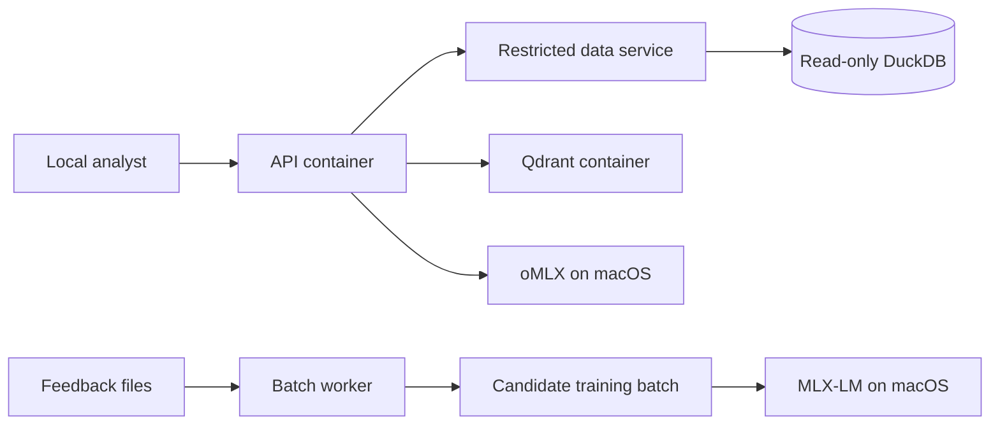

# Credit-Risk Qwen Fine-Tuning Starter

Runnable development scaffold for a local, English-language credit-risk advisory copilot covering Retail, SME and Corporate portfolios under separate SAMA and CBUAE knowledge domains.

## Recommended architecture

- Qwen3.5-9B 4-bit common QLoRA adapter through MLX-LM.
- Qwen3.8-27B 4-bit as an on-demand teacher/challenger.
- oMLX for local inference evaluation.
- Dynamic portfolio schemas and parameterised query compilation.
- Deterministic Python/SQL for ratios and model outputs.
- Four guardrail layers: input, retrieval, output and abstention/action control.
- Feedback triage that sends errors to the correct component before considering retraining.

## Execution model: Docker plus native Mac services

The repository uses a hybrid architecture. This is intentional:

| Component | Execution | Reason |
|---|---|---|
| API gateway and guardrails | Docker container | Has no database mount and cannot execute SQL |
| Restricted data service | Docker container | Sole read-only database owner; compiles only allowlisted parameterised queries |
| Qdrant | Docker container | Isolated vector store for SAMA/CBUAE namespaces |
| Feedback batch worker | On-demand Docker container | Reads feedback and writes curated candidate batches only |
| Test runner | On-demand Docker container | Reproducible architecture and regression tests |
| oMLX | Native macOS process | Uses Apple Metal/ANE optimisations unavailable through Docker Desktop |
| MLX-LM QLoRA training | Native macOS process | Requires direct Apple Silicon acceleration and unified memory |

The API and data service are separated by an internal Docker network. Only the data service receives the read-only `data/curated` mount. The API receives validated rows—not SQL access. Both services load version-pinned, default-deny schema and architecture policies.



## Quick start

```bash
cd credit-risk-finetuning
uv venv --python 3.12
source .venv/bin/activate
uv sync --extra dev
pytest
```

Start the development API:

```bash
uv run credit-risk-api
```

## Docker quick start

Prerequisites:

- Docker Desktop for Mac.
- oMLX running natively on `127.0.0.1:8000`.
- An existing DuckDB file at `data/curated/credit_risk.duckdb` with the allowlisted tables.

```bash
cp .env.docker.example .env
docker compose build
docker compose up -d api data-service qdrant
docker compose ps
curl http://127.0.0.1:8080/health
```

Run the isolated test task:

```bash
docker compose --profile test run --rm tests
```

Run the feedback batch task after placing `feedback.jsonl` in `data/feedback/`:

```bash
docker compose --profile batch run --rm feedback-worker
```

Run QLoRA natively on macOS, outside Docker:

```bash
uv sync --extra training
uv run credit-risk-train --config configs/training.yaml --execute
```

### Architecture-level schema enforcement

The control is implemented at multiple layers:

1. `configs/architecture_policy.yaml` defines explicit service capabilities with default deny.
2. `configs/schema_registry.yaml` allowlists tables, columns, metrics, portfolio applicability, grain, types and ranges.
3. The API validates the typed `QueryPlan` but has no database mount.
4. The restricted data service validates the same version-pinned schemas again.
5. The data service generates parameterised SQL internally and opens DuckDB in read-only mode; the API applies a request timeout.
6. Docker isolates the data service on an internal network and mounts curated data as read-only.
7. A designated human reviewer can inspect the exact parameterised SQL template, approved tables/columns, schema version and query hash before relying on the result. Parameter values are masked by default; displayed SQL is read-only and cannot be edited and executed directly.

SQL review feedback must identify the incorrect table, column, join, grain, filter or governed calculation. Any corrected query plan is sent through the complete schema and architecture validation cycle before execution. Database credentials, internal paths and raw database errors are never returned.

Validate a query plan:

```bash
curl -X POST http://127.0.0.1:8080/v1/query/validate \
  -H 'Content-Type: application/json' \
  -d '{
    "user_text": "Analyse the obligor credit deterioration",
    "query_plan": {
      "portfolio": "corporate",
      "jurisdiction": "SAMA",
      "entity_level": "obligor",
      "obligor_id": "OBL-123",
      "date_from": "2025-01-31",
      "date_to": "2025-12-31",
      "metrics": ["current_ratio", "dscr", "pit_pd", "stage"],
      "analysis_type": "credit_deterioration"
    }
  }'
```

To retrieve approved rows through the isolated data service, change the endpoint to `/v1/query/fetch`. The request format is identical.

Print the reviewed MLX-LM training command:

```bash
uv run credit-risk-train --config configs/training.yaml
```

Execute only after the dataset and model path have been validated:

```bash
uv run credit-risk-train --config configs/training.yaml --execute
```

## Data safety

Raw, curated, training and model files are ignored by Git. Do not place confidential data in source control. Use tokenised identifiers in training data. The query compiler returns parameterised SQL and never interpolates obligor values into query text.

## Current boundary

This repository is a Phase 1 development scaffold. Database execution, document parsing, Qdrant indexing and the institution-specific PIT PD/ECL engines are integration points because their physical schemas and formulas must be supplied by the bank.

See [Qwen_Credit_Risk_Fine_Tuning_Feedback_Plan.md](../Qwen_Credit_Risk_Fine_Tuning_Feedback_Plan.md) for the complete design and phased roadmap.

